# 📋 Full & Final Settlement & Digital Clearance
## Complete Operational Guide — v2.0

> **Audience:** HR Administrators, Department Managers, Operations Heads, Departing Employees  
> **Purpose:** End-to-end operational guide explaining the enterprise Full & Final Settlement (FnF) workflow, 3-stage signature verification, and departmental clearance system.

---

## Table of Contents

1. [System Overview](#1-system-overview)
2. [How the Full Workflow Works](#2-how-the-full-workflow-works)
3. [Workflow Flowchart — End to End](#3-workflow-flowchart--end-to-end)
4. [HR Admin: Creating & Editing the Settlement Form](#4-hr-admin-creating--editing-the-settlement-form)
5. [Sharing the Form with the Employee](#5-sharing-the-form-with-the-employee)
6. [Employee: Filling & Signing the Clearance Form](#6-employee-filling--signing-the-clearance-form)
7. [Departmental Clearance & Handover Verification (Section 3)](#7-departmental-clearance--handover-verification-section-3)
8. [Multi-Stage Countersign & Company Authorization (3 Signatures)](#8-multi-stage-countersign--company-authorization-3-signatures)
9. [Official Print & PDF Export](#9-official-print--pdf-export)
10. [Audit Trail & Activity Log](#10-audit-trail--activity-log)
11. [Feature Roadmap & Implementation Status](#11-feature-roadmap--implementation-status)

---

## 1. System Overview

The **Full & Final Settlement & Clearance** module is a paperless, legally binding offboarding platform built directly into the HRMS. It eliminates scattered emails, physical paperwork, and manual checklists, replacing them with a unified digital workflow.

It delivers five core capabilities:

| # | What It Does | Key Benefit |
|---|---|---|
| 1 | **Financial Settlement Calculation** | Real-time calculation of gross payable, deductions, and net balance with zero manual math. |
| 2 | **Departmental Asset Verification** | Pre-certified department clearance with clean segregation into *Pending Handover* and *Approved Clearances*. |
| 3 | **Interactive Employee Clearance** | Departing employees review financials, add handover notes/serial numbers, answer questionnaires, and sign digitally. |
| 4 | **Customizable Legal Undertaking** | Companies can customize NDA, intellectual property, and separation terms per employee, with a one-click reset to standard clauses. |
| 5 | **3-Stage Executive Sign-off** | Tripartite verification: Employee Acceptance → Department Manager Countersign → Company Authorized Signatory & Payment Disbursal. |

---

## 2. How the Full Workflow Works

The end-to-end settlement lifecycle operates across three structured phases:

```
┌─────────────────────────────────────────────────────────────────────────────┐
│  PHASE 1: HR CREATES & CONFIGURATES SETTLEMENT                              │
│  → Employee Details → Financials (A & B) → Departmental Checklist          │
│  → Section-Wise Custom Questions → Customizable Legal Undertaking           │
└─────────────────────────────────────────────────────────────────────────────┘
                                    │
                                    ▼
┌─────────────────────────────────────────────────────────────────────────────┐
│  PHASE 2: SECURE SHARING & EMPLOYEE DIGITAL CLEARANCE (STAGE 1 SIGNATURE)   │
│  → 64-char encrypted link via Email / WhatsApp (30-day auto-expiry)         │
│  → Employee reviews financials & company-approved clearances                │
│  → Adds handover notes / courier tracking # on pending items                │
│  → Answers employee questions → Agrees to legal terms → Signs digitally     │
│  → Automated Email & In-App Dashboard Alert sent to HR Admin                │
└─────────────────────────────────────────────────────────────────────────────┘
                                    │
                                    ▼
┌─────────────────────────────────────────────────────────────────────────────┐
│  PHASE 3: MANAGEMENT VERIFICATION & PAYMENT (STAGE 2 & 3 SIGNATURES)        │
│  → Stage 2: Department Manager / HOD reviews handover & countersigns        │
│  → Stage 3: Company Authorized Signatory signs on behalf of the company     │
│  → Payment Disbursal recorded (Mode, Date, UTR Reference No.)               │
│  → Settlement marked "Cleared & Disbursed" → Audit Trail Logged             │
│  → Executive 3-Signature Statement PDF generated for corporate archives     │
└─────────────────────────────────────────────────────────────────────────────┘
```

---

## 3. Workflow Flowchart — End to End

```mermaid
flowchart TD
    A([🏁 Start: Employee Separation Initiated]) --> B[HR opens Full & Final Settlement module]
    B --> C[HR selects Employee — Profile auto-filled]
    C --> D[HR sets LWD & Separation Reason]
    D --> E[HR enters Earnings & Deductions\nNet Payable auto-calculates in real time]
    E --> F[HR sets Departmental Clearance Checklist\nCategory, Item & initial status]
    F --> G[HR reviews & customizes Legal Undertaking terms\nor keeps standard corporate clauses]
    G --> H{Add Custom Questions\nto Sections 1–4?}
    H -- Yes --> I[In-Section Form Builder:\nShort Text, Paragraph, Dropdown, Date, Number\nTargeted to HR or Employee]
    H -- No --> J
    I --> J[HR saves Settlement in Draft]

    J --> K{Share with Employee}
    K -- Auto Email --> L[Send to Employee email with secure link]
    K -- WhatsApp / Direct --> M[Copy 64-char token link or 1-Click WhatsApp]
    L --> N([📨 Employee receives secure link])
    M --> N

    N --> O[Employee opens link on any device\nNo login required]
    O --> P[Reviews Financial Breakdown & Net Settlement]
    P --> Q[Reviews Section 3: Clearance Checklist\nSees Cleared by Company vs Pending Handover]
    Q --> R[Enters notes / serial numbers on pending handover items]
    R --> S[Fills any employee-targeted questionnaire fields]
    S --> T[Reads Legal Undertaking & checks mandatory confirmation box]
    T --> U[Draws or Uploads Digital Signature]
    U --> V[Employee clicks Sign & Submit]
    V --> W[✅ Submission saved with Timestamp & IP Address]
    W --> X[Automated Email & Dashboard Alert sent to HR Creator]

    X --> Y[Stage 2: Department Manager / HOD reviews & countersigns]
    Y --> Z[Stage 3: Company Authorized Signatory sign-off\nRecords Payment Mode, Date & UTR Ref]
    Z --> AA[Status updated to Cleared & Disbursed]
    AA --> AB[Audit Trail event logged]
    AB --> AC([📄 Official 3-Signature PDF ready for archives])
```



---

## 4. HR Admin: Creating & Editing the Settlement Form

The admin form ([create.blade.php](file:///e:/laragon/www/idab/hrms.idab/resources/views/settlement/create.blade.php) and [edit.blade.php](file:///e:/laragon/www/idab/hrms.idab/resources/views/settlement/edit.blade.php)) features a unified 5-section design matching the enterprise Tabler/HRMGo admin theme.

### Section 1 — Employee & Separation Details
- **Select Employee**: Searchable Select2 dropdown. Selecting an employee auto-populates their Employee ID, Department, Designation, and Date of Joining (DOJ).
- **Last Working Day (LWD)**: The reference date for salary calculation and asset recovery.
- **Reason for Separation**: e.g., *Resignation Accepted*, *Contract Ended*, *Mutual Release*.
- **In-Section Custom Questions (`separation`)**: Configure fields such as notice shortfall waiver notes, relocation details, or exit interview notes.

### Section 2 — Financial Clearance Breakdown
Real-time dual-table financial calculator:
- **Earnings & Payables (A)**: Basic salary to LWD, earned leave encashment, performance bonus, gratuity, arrears.
- **Deductions & Recoveries (B)**: Notice shortfall recovery, outstanding loan balance, asset damage, TDS.
- **Net Final Settlement Amount = A − B**: Automatically computed and highlighted.
- **In-Section Custom Questions (`financial`)**: Add bank account verification notes, loan clearance NOC status, gratuity eligibility notes.

### Section 3 — Departmental & Asset Clearances Checklist
- Build checklist checkpoints row-by-row with **Category** (*IT & Hardware, Admin, HR, Finance*), **Item Description**, and **Status** (*Pending*, *Returned / Cleared*, *Not Applicable*).
- HR departments can pre-approve and certify cleared items directly before sending the form.
- **In-Section Custom Questions (`assets`)**: Add laptop serial numbers, BYOD remote wipe declarations, access badge returns.

### Section 4 — Employee Handover & Legal Undertaking
- **Custom Legal Declaration Terms**: A dedicated editor allows HR to customize exact legal terms, non-compete clauses, and IP undertakings.
- **Reset to Default Terms**: One-click button reverts to company standard legal wording.
- **In-Section Custom Questions (`employee`)**: Add questions departing employees must complete online before signing (e.g. personal email, forwarding address).

### Section 5 — Management Sign-off & Payment Information (Edit Mode)
- Record settlement clearance status (*Pending* or *Cleared*).
- Payment Date, Payment Mode (*Bank Transfer, NEFT/RTGS, Cheque, UPI, Cash*), and Transaction Reference No. (UTR).
- HR Representative Name and Authorized Signatory Name.

---

## 5. Sharing the Form with the Employee

Every settlement receives a **64-character encrypted token URL** that does not expose internal database IDs:

| Sharing Channel | Action |
|---|---|
| **📧 Auto Email** | Click **Send to Employee**. Sends a formatted HTML email with net payable amount and a direct **"Open Clearance Form"** button. |
| **💬 WhatsApp** | Click **Share on WhatsApp**. Opens an interactive modal where HR can personalize/modify the message, specify an optional phone number, or reset to standard template before opening in WhatsApp. |
| **🔗 Copy Link** | One-click button copies the URL to your clipboard for Slack, Teams, or manual email. |
| **🔄 Link Expiry & Regeneration** | Links expire in 30 days. HR can click **Regenerate Link** at any time to generate a fresh token and extend validity by 30 days. |
| **↩️ Recall to Draft** | If terms need revision after sending, HR can click **Recall to Draft** to temporarily pause the link while adjusting figures. |

---

## 6. Employee: Filling & Signing the Clearance Form

The employee opens the secure public view on any browser (mobile, tablet, or desktop) with zero login credentials required:

1. **Header & Net Statement**: Clear corporate branding, settlement reference number, and financial summary.
2. **Section 1 & 2**: Separation particulars and certified financial breakdown.
3. **Section 3**: Departmental clearance status (see details below).
4. **Section 4 — Formal Sign-Off**:
   - Reads company-configured legal undertaking.
   - Checks mandatory declaration confirmation.
   - Completes any required employee questionnaire fields.
   - Enters optional remarks or forwarding contact information.
   - **Digital Signature**: Draws on canvas (with touch-action support for mobile) or uploads signature image.
   - Clicks **Sign & Submit Settlement**.
5. **Post-Submission**:
   - The page transforms into an immutable **Signed & Confirmed Certificate** showing the digital signature, date/time, and verified IP address.
   - Automated email and in-app dashboard notifications alert the HR Admin creator immediately.

---

## 7. Departmental Clearance & Handover Verification (Section 3)

To prevent confusion between company-internal actions and employee handovers, Section 3 employs a **segregated layout**:

### Clear Header Badges
- `[✓ X Cleared by Company]`: Displays how many items have already been reviewed and certified by department managers (green badge).
- `[⏱ Y Pending Handover]`: Highlights items awaiting physical handover or final department sign-off (amber badge).

### Pending Handover Progress
- **Pending Scope Counter**: Explicitly displays **`0 / Y Pending`** with title `Pending Handover Items: Y Item(s) Remaining`.
- **Amber Progress Bar**: Starts at 0% and focuses purely on remaining handover actions, avoiding fractional confusion.
- When all items are approved, automatically displays: **`All Handover Items Cleared (100% Completed)`**.

### Two Distinct Lists
1. **Items Awaiting Handover & Department Verification**:
   - Lists only pending checkpoints.
   - Includes optional handover note inputs for the employee (e.g., courier tracking number, asset serial number).
2. **Completed & Approved Clearances by Company**:
   - Dedicated card below listing all company-certified completed checkpoints with green checkmarks and `Cleared / Returned` badges.
3. **Not Applicable (N/A) Items**:
   - Grouped neatly at the bottom in neutral pill badges.

---

## 8. Multi-Stage Countersign & Company Authorization (3 Signatures)

The settlement incorporates an authentic tripartite signature and approval architecture:

```
┌─────────────────────────────────────────────────────────────────────────────┐
│  STAGE 1: EMPLOYEE ACCEPTANCE                                               │
│  → Digital Signature captured on public form                                │
│  → Employee Name, Employee Code, Signed Timestamp, Verified IP              │
│  → Formal undertaking confirmation                                          │
└─────────────────────────────────────────────────────────────────────────────┘
                                    │
                                    ▼
┌─────────────────────────────────────────────────────────────────────────────┐
│  STAGE 2: HR / DEPARTMENT MANAGER VERIFICATION                              │
│  → Manager / HOD opens settlement record on admin panel                     │
│  → Reviews asset handover and inputs verification remarks                   │
│  → Draws digital countersignature with timestamp                            │
└─────────────────────────────────────────────────────────────────────────────┘
                                    │
                                    ▼
┌─────────────────────────────────────────────────────────────────────────────┐
│  STAGE 3: COMPANY AUTHORIZED SIGNATORY & PAYMENT DISBURSAL                  │
│  → Company Authorized Signatory signs on behalf of the company              │
│  → Formatted as: "For & On Behalf of [Company Name]"                        │
│  → Authorized Signatory Name, Title & Approval Date                         │
│  → Payment Details recorded: Mode, Disbursal Date, UTR / Cheque Ref No.     │
│  → Settlement transitions to "Cleared & Disbursed"                          │
└─────────────────────────────────────────────────────────────────────────────┘
```

### Segregated Display on Admin Panel (`settlement.show`)
- **Left Column — Company Authorized Signatory Endorsement**:
  - `For & On Behalf of: [Company Name]`
  - Signatory Name & Title (`Company Authorized Signatory`)
  - Authorization Date
  - Digital Signature preview with corporate seal/sign-off badge.
- **Right Column — Disbursal & Payment Settlement Record**:
  - Status: `Cleared & Paid`
  - Net Amount Disbursed
  - Payment Mode (Bank Transfer, NEFT/RTGS, Cheque, UPI, Cash)
  - Disbursal Date & UTR / Transaction Reference Number
  - HR Verification Desk signatory

### Dual Signature Modes (Draw Canvas vs. Upload Image)
For both **HR/Department Manager Countersign** and **Company Authorized Signatory Approval**, the modal gives administrators two flexible options:
1. **✍️ Draw Signature**: An interactive HTML5 canvas allowing drawing with mouse, trackpad, or touch/stylus with a 1-click **Clear** button.
2. **📁 Upload Signature Image**: Allows uploading an official scanned signature file (`.png`, `.jpg`, `.jpeg` up to 2MB).
   - Live visual preview of the uploaded signature.
   - 1-click **Remove / Change** option.
   - Automatically converted to high-fidelity Base64 string for seamless PDF rendering and archival storage without external file dependency breakages.

---

## 9. Official Print & PDF Export

The PDF statement ([pdf.blade.php](file:///e:/laragon/www/idab/hrms.idab/resources/views/settlement/pdf.blade.php)) is an official, print-ready document formatted for legal archives and financial audits:

### Document Structure:
- **Header**: Corporate logo, registered address, telephone, email, and settlement reference.
- **Section A**: Employee profile, DOJ, LWD, and reason for separation.
- **Section B**: Itemized Earnings (A), Deductions (B), and Net Final Settlement Amount.
- **Section C**: Departmental Clearance Matrix with categories, items, certified status, and notes.
- **Section D**: Section-wise custom questionnaire records.
- **Payment Disbursal Record Bar**: A 1-row summary bar displaying Settlement Status, Payment Mode, Disbursal Date, and UTR Reference Number.
- **Section E — 3-Column Executive Signature Matrix**:
  - **Column 1 (Separating Employee)**: Signature image, Employee Name, Designation, Code, Timestamp, and IP.
  - **Column 2 (Department Verification)**: Signature image, Manager / HOD Name, Designation, Timestamp, and remarks.
  - **Column 3 (Company Authorized Signatory)**: Header `FOR [COMPANY NAME]`, Signature image, Signatory Name, Title `Company Authorized Signatory`, Approval Date, and `OFFICIAL SEAL & SIGN-OFF` badge.

---

## 10. Audit Trail & Activity Log

Every action on the settlement is immutably recorded in the `activity_logs` audit trail and displayed in an executive timeline on the detail view:
- Settlement created in Draft
- Secure link shared via Auto Email or WhatsApp
- Secure link extended / regenerated
- Employee submitted digital signature & comments (with IP)
- Department Manager countersigned
- Settlement recalled to Draft for revisions
- Company Authorized Signatory approved and payment disbursed (with UTR reference)

---

## 11. Feature Roadmap & Implementation Status

| # | Feature / Enhancement | Priority | Status in v2.0 |
|---|---|---|---|
| 1 | **Manager / HOD Countersign Support** | 🔴 High | **Completed ✅** |
| 2 | **Link Expiry & Instant Regeneration** | 🔴 High | **Completed ✅** |
| 3 | **Automatic Email to HR on Submission** | 🔴 High | **Completed ✅** |
| 4 | **Token Expiry Indicator on Dashboard** | 🔴 High | **Completed ✅** |
| 5 | **One-Click WhatsApp Share Button** | 🟡 Medium | **Completed ✅** |
| 6 | **Audit Trail & Activity Log Timeline** | 🟡 Medium | **Completed ✅** |
| 7 | **Excel / CSV Bulk Export** | 🟡 Medium | **Completed ✅** |
| 8 | **In-Section Form Builder (Sections 1–4)** | 🟡 Medium | **Completed ✅** |
| 9 | **Customizable Legal Declaration Terms** | 🟡 Medium | **Completed ✅** |
| 10 | **Department Clearance Segregation (`0/X Pending`)** | 🟡 Medium | **Completed ✅** |
| 11 | **Company Authorized Signatory & Disbursal Bar** | 🟡 Medium | **Completed ✅** |
| 12 | **Admin Panel Edit Form Alignment** | 🟡 Medium | **Completed ✅** |
| 13 | **Mobile-Optimized Signature Canvas** | 🟡 Medium | **Completed ✅** |
| 14 | **Settlement Revision (Recall to Draft)** | 🟡 Medium | **Completed ✅** |
| 15 | **Real-Time In-App Dashboard Notifications** | 🟡 Medium | **Completed ✅** |
| 16 | **Dual Signature Modes (Draw Canvas + Upload Image File)** | 🟡 Medium | **Completed ✅** |

---

> **Document Version:** 2.0  
> **Last Updated:** September 2026  
> **Module:** Full & Final Settlement & Digital Clearance — HRMS  
> **Author:** Antigravity Engineering
