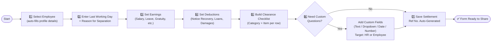
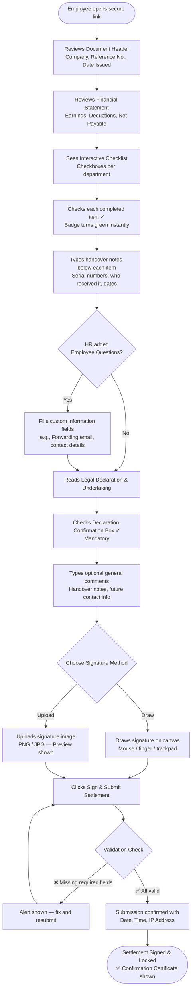

# 📋 Full & Final Settlement & Digital Clearance
## Complete Operational Guide — v1.0

> **Audience:** HR Administrators, Operations Managers, Departing Employees / Customers  
> **Purpose:** End-to-end explanation of the Full & Final Settlement (FnF) workflow — no technical jargon, no code.

---

## Table of Contents

1. [System Overview](#1-system-overview)
2. [How the Full Workflow Works](#2-how-the-full-workflow-works)
3. [Workflow Flowchart — End to End](#3-workflow-flowchart--end-to-end)
4. [HR Admin: Creating the Settlement Form](#4-hr-admin-creating-the-settlement-form)
5. [HR Admin Flowchart — Form Creation Steps](#5-hr-admin-flowchart--form-creation-steps)
6. [Sharing the Form with the Employee](#6-sharing-the-form-with-the-employee)
7. [Employee: Filling & Signing the Clearance Form](#7-employee-filling--signing-the-clearance-form)
8. [Employee Flowchart — Clearance Submission](#8-employee-flowchart--clearance-submission)
9. [After Submission — What Happens Next](#9-after-submission--what-happens-next)
10. [Suggestions & Improvements](#10-suggestions--improvements)

---

## 1. System Overview

The **Full & Final Settlement & Clearance** module is a modern, paperless, legally compliant offboarding system built into the HRMS. It replaces scattered emails, paper forms, and manual checklists with a single unified digital workflow.

It solves four key needs in one system:

| # | What It Does | Benefit |
|---|---|---|
| 1 | **Financial Settlement Calculation** | Automatically computes gross payable, deductions, and net final amount |
| 2 | **Departmental & Asset Handover Checklist** | Tracks every equipment return, credential revocation, and clearance per department |
| 3 | **Interactive Employee Clearance** | Employee checks items off online, adds handover notes, and confirms from any device |
| 4 | **Digital Sign-Off with Verification** | Captures legally valid digital signatures with timestamp and IP address |

---

## 2. How the Full Workflow Works

The entire process has three main stages:

```
┌─────────────────────────────────────────────────────────────────────────────┐
│  STAGE 1: HR CREATES THE SETTLEMENT FORM                                   │
│  → Select Employee → Set Financials → Build Checklist → Add Custom Fields  │
└─────────────────────────────────────────────────────────────────────────────┘
                                    │
                                    ▼
┌─────────────────────────────────────────────────────────────────────────────┐
│  STAGE 2: FORM IS SHARED WITH EMPLOYEE                                     │
│  → Auto-Email with secure link  OR  Copy link & share via chat/email       │
└─────────────────────────────────────────────────────────────────────────────┘
                                    │
                                    ▼
┌─────────────────────────────────────────────────────────────────────────────┐
│  STAGE 3: EMPLOYEE REVIEWS, CLEARS ITEMS & SIGNS DIGITALLY                 │
│  → Reviews financials → Checks items → Writes notes → Signs → Submits      │
└─────────────────────────────────────────────────────────────────────────────┘
                                    │
                                    ▼
┌─────────────────────────────────────────────────────────────────────────────┐
│  OUTCOME: CONFIRMED, LOCKED & DOWNLOADABLE PDF                             │
│  → Employee sees confirmation page → HR reviews → PDF ready for archives   │
└─────────────────────────────────────────────────────────────────────────────┘
```

---

## 3. Workflow Flowchart — End to End

```mermaid
flowchart TD
    A([🏁 Start: Employee Separation Initiated]) --> B[HR opens Full & Final Settlement module]
    B --> C[HR selects Employee from dropdown]
    C --> D[HR enters Last Working Day & Reason for Separation]
    D --> E[HR sets Earnings & Deductions\nNet Amount auto-calculates]
    E --> F[HR builds Departmental Clearance Checklist\nCategory + Item + Status per row]
    F --> G{Optional:\nAny Custom Questions?}
    G -- Yes --> H[HR adds Custom Fields\nShort Text / Dropdown / Date / Number\nTargeted to HR or Employee]
    G -- No --> I
    H --> I[HR saves the Settlement Record\nStatus: Draft → Auto-generates Reference No.]

    I --> J{How to Share\nwith Employee?}
    J -- Email --> K[HR clicks Send to Employee\nSystem sends email with secure link]
    J -- Manual --> L[HR copies secure link\nShares via WhatsApp / Slack / Email]
    K --> M
    L --> M

    M([📨 Employee receives secure link])
    M --> N[Employee opens link in browser\nMobile / Tablet / Desktop — No login needed]
    N --> O[Employee reviews company header,\nSettlement Ref No., and financial breakdown]
    O --> P[Employee sees interactive checklist\nOne checkbox per clearance item]
    P --> Q[Employee checks items as completed\nBadge turns green, row turns green]
    Q --> R[Employee types handover notes / serial numbers\nUnder each checked item]
    R --> S{Any Additional\nEmployee Questions?}
    S -- Yes --> T[Employee fills custom fields\nforwarding email, contact, etc.]
    S -- No --> U
    T --> U
    U --> V[Employee reads & accepts\nDeclaration & Legal Undertaking]
    V --> W[Employee writes general comments\nOptional remarks field]
    W --> X{Signature Method}
    X -- Draw --> Y[Employee draws signature\non screen or touch device]
    X -- Upload --> Z[Employee uploads signature image\nPNG / JPG preview shown]
    Y --> AA[Employee clicks Sign & Submit Settlement]
    Z --> AA
    AA --> AB{All Required Fields\nFilled?}
    AB -- No --> AC[⚠️ Validation alert shown\nEmployee corrects and resubmits]
    AC --> AA
    AB -- Yes --> AD[✅ Submission recorded with Date, Time & IP]
    AD --> AE[Employee sees Confirmation Certificate page\nLocked — cannot be changed]
    AD --> AF[HR Dashboard status updates\nDraft → Sent → Signed]
    AF --> AG[HR reviews submitted checklist, notes & signature]
    AG --> AH[HR / Management downloads PDF\nOfficial print-ready document]
    AH --> AI([🎉 Settlement Complete])
```



---

## 4. HR Admin: Creating the Settlement Form

### Step 1 — Employee & Separation Details
- Navigate to **Full & Final Settlement** from the left sidebar and click **Create Settlement**.
- Select the employee from the searchable dropdown. Once selected, their Employee Code, Designation, Department, and Date of Joining are automatically filled.
- Set the **Last Working Day (LWD)** — this is the date used for all salary proration calculations.
- Enter the **Reason for Separation**, such as *Resignation Accepted*, *Contract Ended*, *Mutual Release*, or *Retirement*.

---

### Step 2 — Financial Clearance Breakdown

This section has two columns that auto-calculate in real time:

**Left Column — Earnings & Payables (A):**
- Salary payable up to the last working day
- Earned & unused leave encashment
- Gratuity (if applicable)
- Performance bonus or incentive payout
- Any other custom earning row you add

**Right Column — Deductions & Recoveries (B):**
- Notice period shortfall / recovery
- Outstanding loan or advance balance
- Asset / hardware damage recovery
- Any other custom deduction row you add

**Net Final Payable = A − B**
The system calculates and displays this automatically. No manual math required.

---

### Step 3 — Departmental & Asset Clearances Checklist

This is the core of the clearance form. You build it row by row:

| Field | What to Enter | Examples |
|---|---|---|
| **Category** | Department or functional group | *IT & Hardware*, *Admin & Facility*, *Cloud & Code*, *Finance & Accounts*, *Operations* |
| **Checklist Item** | What exactly must be returned or completed | *Company laptop and charger returned*, *Official email account suspended*, *Locker keys and uniform returned* |
| **Status** | Initial status set by HR | Usually left as *Pending* — the employee will update this online |

- Click **Add Checkpoint** to insert new rows anytime.
- Click the **🗑 trash icon** on any row to delete it.
- There is no limit to how many checkpoints you can add.
- **There is no fixed industry template** — you can freely create any category and item for any business type: manufacturing, healthcare, salon, logistics, legal, retail, hospitality, etc.

---

### Step 4 — Custom Questions (Optional, Per Section)

Each section (Separation Details, Financial Clearance, Asset Clearance, Employee Handover) has its own **"Add Question to this Section"** button.

| Setting | Options | What It Means |
|---|---|---|
| **Question Title** | Any text | e.g., *Forwarding Email*, *Asset Serial Number*, *GitHub Username*, *Feedback Survey* |
| **Input Type** | Short Text, Paragraph, Dropdown, Date, Number | Defines what the respondent sees |
| **Who Fills This?** | HR Certified / Employee to Fill Online | HR questions are completed at creation; Employee questions appear on the public clearance form |
| **Required?** | Yes / No | If required, the form cannot be submitted without an answer |

---

### Step 5 — Save Settlement

Click **Save Full & Final Settlement**. The system:
- Assigns a unique reference number (e.g., `FNF-202609-0001`)
- Sets the status to **Draft**
- Generates a secure encrypted share link (valid for 30 days)

---

## 5. HR Admin Flowchart — Form Creation Steps



---

## 6. Sharing the Form with the Employee

Every saved settlement has a **secure, encrypted link** — a long unique token that only works for that specific settlement. It does not expose any internal database IDs.

### Option A — Auto Email
1. Open the settlement record.
2. Click **Send to Employee** (envelope icon).
3. The system automatically sends an official email to the employee's registered email address containing:
   - Their name and settlement reference number
   - The calculated net payable amount
   - A clear **"Open Clearance Form"** button linking to the secure URL
4. The status updates to **Sent** and the share date is logged.

### Option B — Direct Link Sharing
1. Open the settlement record.
2. Copy the clearance link shown on the page.
3. Share it via WhatsApp, Slack, email, or any messaging platform.

> **Note:** The link is valid for **30 days** from the date of creation. After expiry, the employee sees a polite expiry notice and HR must regenerate the token.

---

## 7. Employee: Filling & Signing the Clearance Form

When the employee opens the secure link, they see an executive-styled digital clearance document — no login required.

---

### Section 1 — Document Header & Status
The page clearly shows:
- Company name and branding
- Settlement Reference Number
- Date the form was issued

---

### Section 2 — Employee Information & Financial Statement
- Name, Employee Code, Designation, Department, Date of Joining, Last Working Day
- Reason for Separation
- **Detailed financial breakdown** with earnings and deductions listed
- **Net Final Payable Amount** prominently displayed

---

### Section 3 — Interactive Clearance Checklist

This is the most important section for the employee to complete:

**How it works:**
1. Each clearance checkpoint (e.g., *Company laptop and charger returned*) is shown with a checkbox, the item description, and a status badge on the right.
2. The employee **checks the checkbox** next to each item they have completed.
3. Instantly:
   - The badge changes from **Pending Clearance** 🟠 to **Completed / Handed Over** 🟢
   - The entire row turns a soft green colour
   - The category counter updates (e.g., `0 / 3 Cleared` → `1 / 3 Cleared`)
4. Below each checkbox is a **comment/notes field** where the employee can type specific handover details:
   - Serial numbers (e.g., *Laptop S/N: C02G4312XQ8R*)
   - Who it was handed to (e.g., *Handed to IT Desk — Rahul Sharma*)
   - Dates or reference IDs
5. **Live overall progress bar** at the top updates in real time showing percentage completion across all departments.
6. Once all items in a department are checked, the department category icon turns into a ✅ green checkmark.

---

### Section 4 — Employee Undertaking & Digital Sign-Off

**4a. Additional Questions** *(only shown if HR set them)*
- Any employee-targeted custom fields appear here in a neat card.
- Each field has a proper label, input type, and helpful placeholder text.

**4b. Legal Declaration & Undertaking**
The employee reads the formal undertaking which states they have:
- Returned all company property, equipment, and software access
- Handed over all client data, source code, and credentials
- No further financial or legal claims against the company
- Agreed to maintain full confidentiality under NDA terms

The employee then checks: **"I have read, understood, and agree to the declaration."**

**4c. General Comments / Remarks** *(optional)*
A free-form text area for the employee to write:
- Future contact email or phone number
- General handover observations
- Notes for the HR team

**4d. Digital Signature**
Two options are available:

| Method | How It Works |
|---|---|
| ✏️ **Draw Signature** | Draw directly on the canvas with mouse, trackpad, or finger on touchscreen. Clear and redraw as many times as needed. |
| ⬆️ **Upload Signature Image** | Drag-and-drop or click to upload a PNG, JPG, or JPEG image. Instantly previewed before submission. |

**4e. Final Submission**
- Employee clicks **Sign & Submit Settlement**.
- The system validates all required fields.
- If anything is missing, a clear alert message identifies what needs to be completed.
- On successful submission, the checklist states, comments, custom field answers, and digital signature are securely recorded.

---

## 8. Employee Flowchart — Clearance Submission



---

## 9. After Submission — What Happens Next

### For the Employee
Immediately after submitting, the page transforms into a **Signed & Confirmed Certificate** that shows:
- A green success checkmark
- "Settlement Signed & Confirmed" heading
- Their submitted digital signature
- Any general comments they wrote
- Exact date and time of submission
- Their verified IP address (proof of submission)
- The page is fully **locked** — no further changes possible

### For HR / Admin
- The settlement status in the dashboard updates from **Sent → Signed**
- HR can open the settlement record to review:
  - Every checklist item and whether it was marked complete
  - Employee's individual handover notes per item
  - Custom field answers
  - Employee's general remarks
  - The digital signature with submission metadata
- HR can click **Download PDF** to generate an official, print-ready document for:
  - Payroll records
  - Finance / Accounts processing
  - Legal archives
  - Audit trail documentation

### PDF Report Contains:
- Company header with branding
- Complete employee profile details
- Full financial breakdown (earnings, deductions, net payable)
- Section-wise departmental clearance table with employee handover notes
- Custom field records
- Employee digital signature
- Submission timestamp and verification details

---

## 10. Suggestions & Improvements

Based on a thorough review of the current module, the following enhancements are recommended to make the system more complete, professional, and production-ready:

---

### 🔴 High Priority

| # | Suggestion | Why It Matters |
|---|---|---|
| 1 | **Manager / HOD Countersign Support** | Currently, only the employee signs. In most organizations, the departing employee's manager or HOD must also countersign the clearance. Adding a multi-stage signature (Employee → Manager → HR) would make the workflow legally complete. |
| 2 | **Link Expiry & Regeneration** | Tokens expire in 30 days. HR currently has no visible button to extend or regenerate the link if an employee delays signing. A "Regenerate Link" button on the admin panel is needed. |
| 3 | **Email to HR on Employee Submission** | When the employee submits, no notification is sent to HR. HR has to check the dashboard manually. An automatic email alert to the HR admin upon submission would ensure timely awareness. |
| 4 | **Token Expiry Visible in Dashboard** | The expiry date of the share link should be visible on the settlement index and detail page so HR knows before it lapses. |

---

### 🟡 Medium Priority

| # | Suggestion | Why It Matters |
|---|---|---|
| 5 | **WhatsApp Share Button** | Add a one-click WhatsApp share button alongside the link on the settlement detail page. Many HR teams communicate via WhatsApp and this would save manual copy-paste. |
| 6 | **Settlement Status History / Activity Log** | Track every status change (Draft → Sent → Signed → Cleared) with who performed the action and when. Provides a complete audit trail. |
| 7 | **Bulk Settlement Export (Excel/CSV)** | Allow HR to export a filtered list of settlements (by date, status, department) to Excel for payroll batch processing and reporting. |
| 8 | **Remarks Field in Checklist for HR** | Currently only the employee can add remarks per checklist item. HR should also be able to add internal remarks on each item (e.g., *Return verified by IT — 17th Sep*) which are visible on the admin panel but not on the employee-facing form. |
| 9 | **Signature on Mobile — Better Canvas** | On mobile devices, the signature canvas can be small and difficult to use accurately. Adding a full-screen signature mode on small screens would improve mobile usability. |
| 10 | **Settlement Revision (Edit after Sent)** | If HR sends the form and then realizes an earning or deduction was wrong, there is no way to revise it once shared. A "Recall & Edit" feature would allow HR to withdraw, correct, and re-send. |

---

### 🟢 Nice to Have (Future Roadmap)

| # | Suggestion | Why It Matters |
|---|---|---|
| 11 | **Employee Self-Declaration Checklist** | Allow the employee to self-declare items as returned before the form is officially created, giving HR a head-start visibility into what is pending. |
| 12 | **OTP Verification on Submission** | Before the employee can submit the final form, send a one-time OTP to their registered mobile number to verify their identity. Makes the digital signature legally stronger. |
| 13 | **Department-Wise Clearance Approval** | Allow each department head (IT, Admin, Finance) to independently mark their specific section as "Approved" from their own login. Builds multi-layer verification. |
| 14 | **Auto-Calculated Gratuity & Leave Encashment** | If the HRMS already stores salary, leaves, and date of joining, auto-populate standard statutory amounts (Gratuity, Leave Encashment) directly into the earnings table. |
| 15 | **Clearance Status Dashboard Widget** | Add a widget on the main HR dashboard showing at a glance: X settlements Pending Signature, Y Signed this Month, Z Overdue (link expired without signature). |
| 16 | **Remind Employee Button** | Allow HR to click "Send Reminder" to resend the secure link email to the employee if they have not opened or completed the form within a set number of days. |

---

> **Document Version:** 1.0  
> **Last Updated:** September 2026  
> **Module:** Full & Final Settlement & Digital Clearance — HRMS
